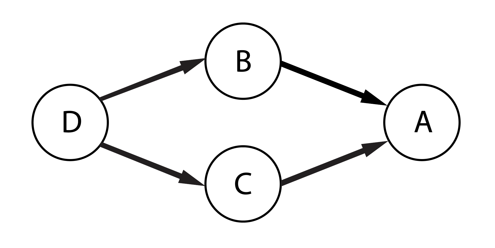

# Build procedure
There are several stages in the build procedure that Beast uses:
1. First, when the `beast` CLI is called, the beast build file is read and all the build rules are parsed and resolved. *Resolving* means replacing variable dereferences with their corresponding values. Along with this, the current working directory is set to the that specified in the command line using the `-d` option.
2. Next, a directed graph is built out of the various target dependencies. Each target is denoted by a node in this graph and dependencies are denoted by edges between these nodes (targets). For example, if target *A* depends on target *B*, then in the target graph, there will be an edge going from node *B* to node *A*.

    For example, for the build rule:
        
        build A : B C
            ! echo "Building A"
        build C : D
            ! echo "Building C"
        build B : D
            ! echo "Building B"
        

3. A necessary condition for a succesful build is that this target graph should be acyclic. Any cycles in this graph result in unresolved dependencies. Once this is ensured, nodes (targets) are sorted in an order suitable for building. This is called topological sorting. If *A* depends on *B*, then *B* comes before *A* in this order. In the above example, *D, B, C, A* and *D, C, B, A* are both valid orderings.
4. Next, the build commands specified in the beast build file for various build rules are executed in the order we got from the previous step. If the number of threads used are more than one, then this as many tasks are carried in parallel as are possible.

    For example, in the above example, after target *D* has been built, targets *B* and *C* can be built in parallel.
